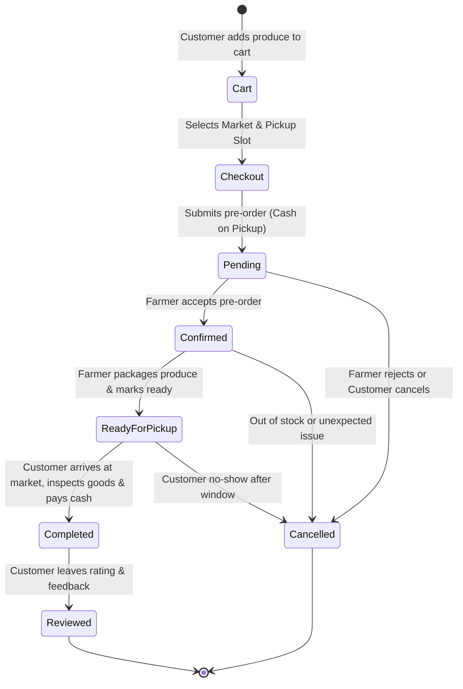
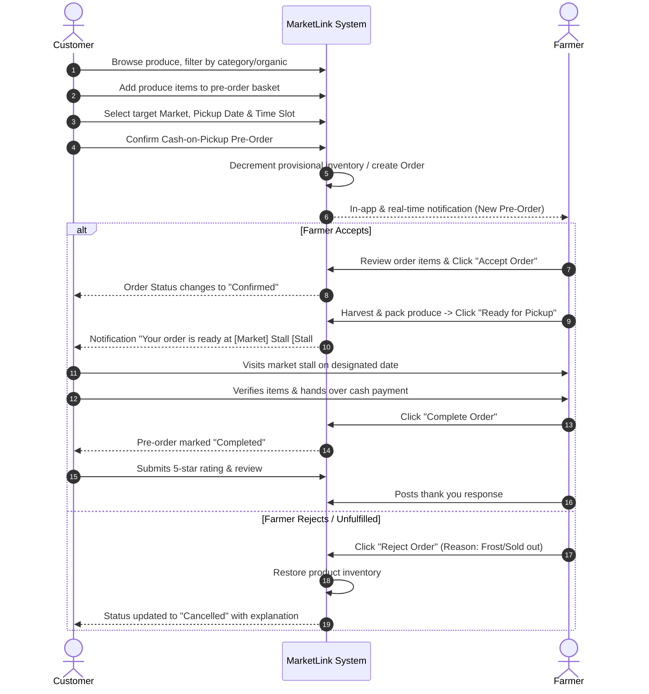

# MarketLink - Pre-Order Fulfillment Activity Diagram

This document illustrates the end-to-end activity and state machine lifecycle for a customer pre-order with cash-on-pickup fulfillment.

---

## Pre-Order Activity & State Machine Lifecycle

---

## Detailed Step-by-Step Swimlane Workflow

