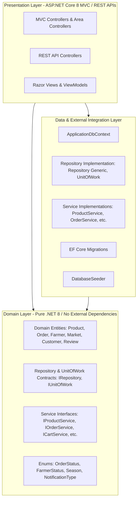

# MarketLink - Architecture & Class Diagram

This document illustrates the Clean Architecture layers, repository design pattern, unit of work, and key domain models powering MarketLink.

---

## 1. Clean Architecture Layers



---

## 2. Core Class Diagram (Mermaid)

```mermaid
classDiagram
    class ApplicationUser {
        +string FirstName
        +string LastName
        +string ProfileImageUrl
        +DateTime CreatedAt
        +bool IsActive
        +string FullName
    }

    class Farmer {
        +int Id
        +string UserId
        +string FarmName
        +string Description
        +string StallNumber
        +FarmerStatus Status
        +bool IsFeatured
        +DateTime RegisteredAt
        +ICollection~Product~ Products
        +ICollection~PickupSlot~ PickupSlots
        +ICollection~Order~ Orders
    }

    class Customer {
        +int Id
        +string UserId
        +string Bio
        +string DefaultCity
        +ICollection~CustomerAddress~ Addresses
        +ICollection~Order~ Orders
        +ICollection~Favorite~ Favorites
    }

    class Product {
        +int Id
        +int FarmerId
        +int CategoryId
        +string Name
        +string Slug
        +decimal Price
        +string Unit
        +int StockQuantity
        +bool IsOrganic
        +Season Season
        +bool IsActive
    }

    class Order {
        +int Id
        +string OrderNumber
        +int CustomerId
        +int FarmerId
        +int MarketId
        +int PickupSlotId
        +DateTime PickupDate
        +OrderStatus Status
        +decimal TotalAmount
        +ICollection~OrderItem~ OrderItems
    }

    class OrderItem {
        +int Id
        +int OrderId
        +int ProductId
        +int Quantity
        +decimal UnitPrice
        +decimal TotalPrice
        +string ProductName
    }

    class PickupSlot {
        +int Id
        +int FarmerId
        +int MarketId
        +DayOfWeek DayOfWeek
        +TimeOnly StartTime
        +TimeOnly EndTime
        +int MaxOrders
        +bool IsActive
    }

    class Market {
        +int Id
        +string Name
        +string Address
        +string City
        +string State
        +double Latitude
        +double Longitude
        +string OperatingHours
        +string OpenDays
    }

    class IRepository~T~ {
        <<interface>>
        +GetByIdAsync(id)
        +GetAllAsync()
        +AddAsync(entity)
        +UpdateAsync(entity)
        +Remove(entity)
        +Query()
    }

    class IUnitOfWork {
        <<interface>>
        +Repository~T~()
        +SaveChangesAsync()
        +BeginTransactionAsync()
        +CommitTransactionAsync()
        +RollbackTransactionAsync()
    }

    ApplicationUser <|-- Farmer : has 1:1
    ApplicationUser <|-- Customer : has 1:1
    Farmer "1" *-- "many" Product : owns
    Farmer "1" *-- "many" PickupSlot : defines
    Farmer "1" *-- "many" Order : fulfills
    Customer "1" *-- "many" Order : places
    Order "1" *-- "many" OrderItem : contains
    Product "1" -- "many" OrderItem : referenced by
    Market "1" *-- "many" PickupSlot : available at
    Order "many" --> "1" Market : collects from
    Order "many" --> "1" PickupSlot : scheduled in
    IUnitOfWork o-- IRepository : manages
```
