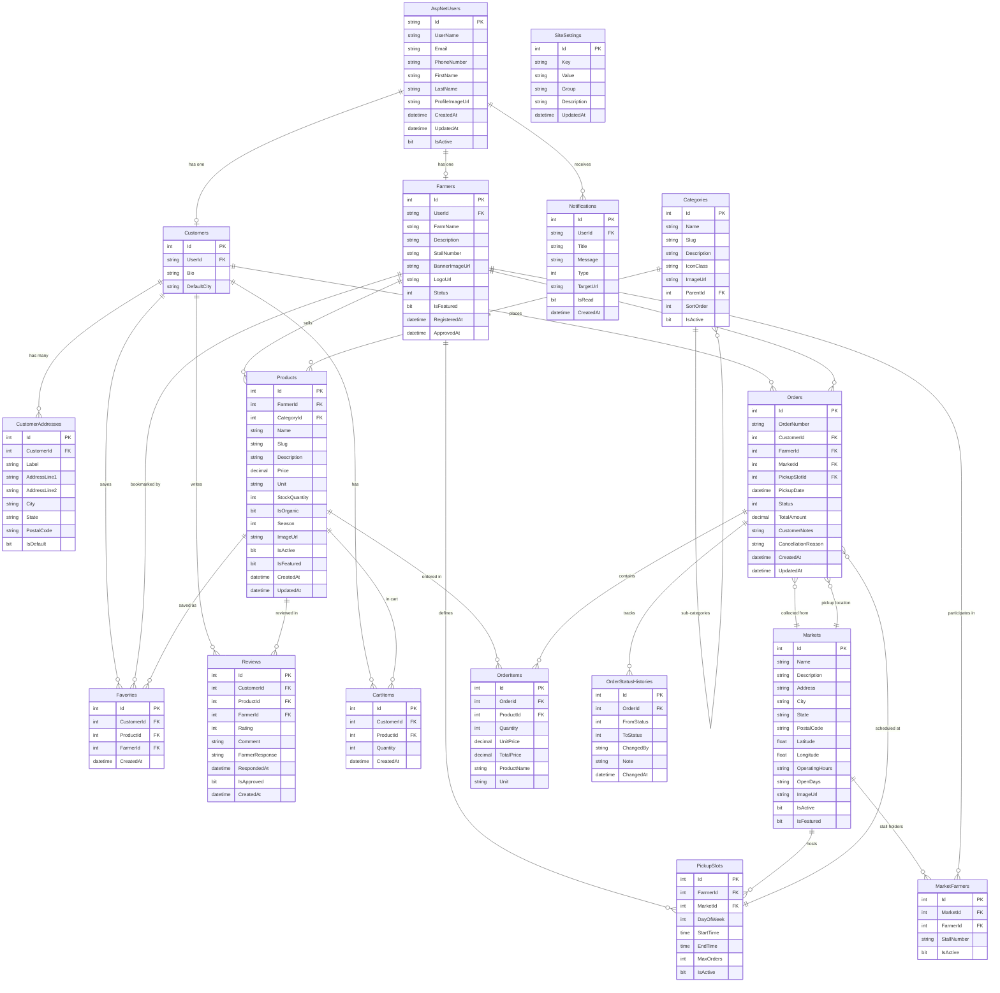

# MarketLink - Database Entity-Relationship (ER) Diagram

This document details the complete relational database schema for **MarketLink**, highlighting entities, primary keys, foreign keys, relationships, and cardinalities.

## Database Technology
- **RDBMS**: Microsoft SQL Server
- **ORM**: Entity Framework Core 8 / 10
- **Data Model**: Code-First with migrations

---

## Entity-Relationship Diagram (Mermaid)

---

## Entity Specifications

| Table | Description | Primary Key | Key Foreign Keys |
| :--- | :--- | :--- | :--- |
| `AspNetUsers` | ASP.NET Identity user accounts | `Id (nvarchar 450)` | - |
| `Customers` | Profile data for shoppers | `Id (int)` | `UserId` -> `AspNetUsers.Id` |
| `CustomerAddresses` | Multi-address book (Home, Work, Other) | `Id (int)` | `CustomerId` -> `Customers.Id` |
| `Farmers` | Approved farm vendor profiles | `Id (int)` | `UserId` -> `AspNetUsers.Id` |
| `Markets` | Physical farmer market locations with lat/long | `Id (int)` | - |
| `MarketFarmers` | Association of farmers and market stalls | `Id (int)` | `MarketId`, `FarmerId` |
| `Categories` | Hierarchical produce categorization | `Id (int)` | `ParentId` -> `Categories.Id` |
| `Products` | Produce catalog with price, unit, stock | `Id (int)` | `FarmerId`, `CategoryId` |
| `PickupSlots` | Reserved pickup time windows | `Id (int)` | `FarmerId`, `MarketId` |
| `Orders` | Customer pre-orders with cash-on-pickup | `Id (int)` | `CustomerId`, `FarmerId`, `MarketId`, `PickupSlotId` |
| `OrderItems` | Line items snapshot for each order | `Id (int)` | `OrderId`, `ProductId` |
| `OrderStatusHistories` | Audit trail of order status transitions | `Id (int)` | `OrderId` -> `Orders.Id` |
| `Reviews` | Customer ratings & feedback with farmer replies | `Id (int)` | `CustomerId`, `ProductId`, `FarmerId` |
| `Favorites` | Bookmarked products and farms | `Id (int)` | `CustomerId`, `ProductId`, `FarmerId` |
| `CartItems` | Persistent pre-order shopping cart | `Id (int)` | `CustomerId`, `ProductId` |
| `Notifications` | Real-time & in-app alerts for users | `Id (int)` | `UserId` -> `AspNetUsers.Id` |
| `SiteSettings` | Dynamic system and portal configurations | `Id (int)` | - |
