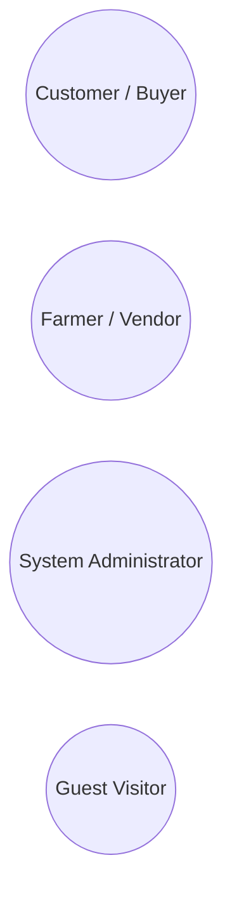

# MarketLink - Use Case Diagram & System Actor Specifications

This document outlines the system actors, functional requirements, and use case interactions across the MarketLink platform.

---

## 1. System Actors

1. **Guest Visitor**: Unauthenticated user browsing markets, exploring farm listings, and inspecting seasonal catalogs.
2. **Customer**: Authenticated user searching produce, adding items to pre-order carts, choosing pickup time slots, placing cash-on-pickup pre-orders, managing favorite produce, writing reviews, and editing multi-address profiles.
3. **Farmer**: Verified vendor managing farm stall profiles, inventory, produce catalog, scheduling market pickup slots, accepting/rejecting pre-orders, marking items ready for pickup, and analyzing sales trends.
4. **Administrator**: System manager approving farmer onboarding, moderating reviews, managing product categories and market locations, overseeing customer accounts, and generating system reports.

---

## 2. Complete Use Case Diagram (Mermaid)

```mermaid
flowchart TB
    subgraph MarketLink System
        %% Public / Guest Use Cases
        UC_BrowseMarkets[Browse Physical Markets & Map Coordinates]
        UC_SearchProduce[Search & Filter Produce by Category / Organic / Season]
        UC_ViewFarmerProfile[View Farmer Profile & Active Stalls]
        UC_Auth[Register / Login / Account Recovery]

        %% Customer Use Cases
        UC_Cart[Manage Pre-Order Cart]
        UC_PlacePreOrder[Place Pre-Order with Market Pickup Slot]
        UC_TrackOrder[Track Pre-Order Status & History]
        UC_Reorder[1-Click Reorder Previous Basket]
        UC_Favorites[Bookmark Favorite Products & Farms]
        UC_WriteReview[Submit Product & Farmer Review]
        UC_ManageProfile[Manage Profile & Address Book]

        %% Farmer Use Cases
        UC_FarmerProfile[Manage Farm Bio, Stall & Market Assignments]
        UC_ManageCatalog[Add, Update & Delete Produce]
        UC_ManageStock[Update Stock & Set Low Stock Alerts]
        UC_ConfigureSlots[Configure Weekly Market Pickup Slots & Capacity]
        UC_ProcessOrders[Review, Accept, Reject & Mark Orders Ready]
        UC_FarmerAnalytics[Inspect Sales Reports & Revenue Analytics]
        UC_ReplyReviews[Respond to Customer Reviews]

        %% Admin Use Cases
        UC_AdminDashboard[Monitor Global Marketplace KPIs]
        UC_ModerateFarmers[Approve, Reject & Suspend Farmer Applications]
        UC_ManageMarkets[Create & Edit Market Locations with Geocoding]
        UC_ManageCategories[Manage Category & Sub-Category Tree]
        UC_ManageCustomers[Inspect & Toggle Customer Accounts]
        UC_ModerateReviews[Audit & Remove Flagged Reviews]
        UC_SystemReports[Export Order & Revenue Reports]
    end

    %% Guest Connections
    Guest --> UC_BrowseMarkets
    Guest --> UC_SearchProduce
    Guest --> UC_ViewFarmerProfile
    Guest --> UC_Auth

    %% Customer Connections
    Customer --> UC_SearchProduce
    Customer --> UC_ViewFarmerProfile
    Customer --> UC_Cart
    Customer --> UC_PlacePreOrder
    Customer --> UC_TrackOrder
    Customer --> UC_Reorder
    Customer --> UC_Favorites
    Customer --> UC_WriteReview
    Customer --> UC_ManageProfile

    %% Farmer Connections
    Farmer --> UC_FarmerProfile
    Farmer --> UC_ManageCatalog
    Farmer --> UC_ManageStock
    Farmer --> UC_ConfigureSlots
    Farmer --> UC_ProcessOrders
    Farmer --> UC_FarmerAnalytics
    Farmer --> UC_ReplyReviews

    %% Admin Connections
    Admin --> UC_AdminDashboard
    Admin --> UC_ModerateFarmers
    Admin --> UC_ManageMarkets
    Admin --> UC_ManageCategories
    Admin --> UC_ManageCustomers
    Admin --> UC_ModerateReviews
    Admin --> UC_SystemReports
```

---

## 3. Core Pre-Order Workflow Matrix

| Action | Customer | Farmer | Admin | Guest |
| :--- | :---: | :---: | :---: | :---: |
| Browse produce & markets | Yes | Yes | Yes | Yes |
| Add produce to cart | Yes | No | No | Redirect to login |
| Select pickup market & slot | Yes | No | No | No |
| Cash-on-pickup pre-order | Yes | No | No | No |
| Accept / reject pre-order | No | Yes | No | No |
| Mark pre-order ready | No | Yes | No | No |
| Mark pre-order completed | No | Yes | No | No |
| Approve farmer accounts | No | No | Yes | No |
| Create markets & categories | No | No | Yes | No |
| Export analytics & reports | No | Yes (own) | Yes (all) | No |
